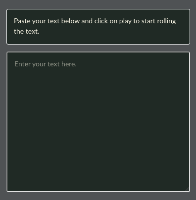
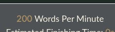

# fast-read
A web interface to fast-read texts.

## Where to use
The page is statically hosted using GitHub Pages at [https://ye-yu.github.io/fast-read][1]. This page is mobile-friendly and can be used offline either as downloaded or browser-cached.

## How to use
When loading the page, you will be presented with a large text area, a group of inputs below it, and a blank box on the right of your widescreen or at the bottom of your mobile screen.

#### 1. Text Area

Put your long text inside here. It can be any languages even those that use a single character as a word, which can be toggled in the configuration below the text area.

#### 2. Delay

This input is for the delay before starting the reading. This can be useful for mobile users that requires scrolling before they are able to focus on the screen.

#### 3. WPM (Words Per Minute)

This configures the number of words to show in a minute.

#### 4. Show By Character

This checkbox enable character-by-character reading instead of word-by-word. This can be useful to languages that can represent a word using a single character (like Mandarin).

<small> Note: The small character in Japanese (like the small っ) is treated as a single character. </small>

#### 5. Control Momentum

This is to give a momentary pause to clause markers such as a comma, a full-stop, etc. This can be useful to give some time to digest rapid information that is coming through the screen.

##### 6. Buttons

Click this button to start rolling the text. When rolling the texts, the shown text on the screen is also highlighted in the text area.

Click this button to pause or stop the rolling of the text.

### Releases
* **v1.0**: This is the first version of fast reading. Basic features includes:
  - Delay, WPM, character toggle, momentum controlling, and play-pause-stop animation.
  - Offline use either browser-cached or as downloaded

[1]: https://ye-yu.github.io/fast-read
